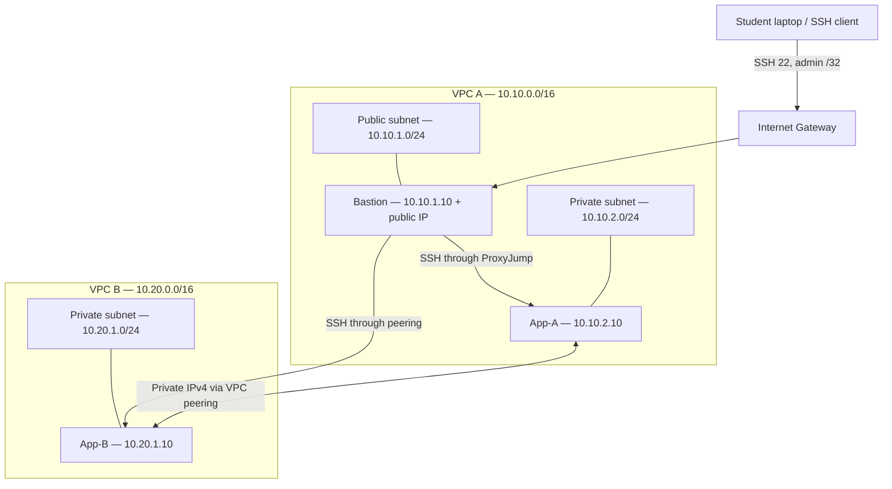

# Architecture

```mermaid
flowchart TB
    Laptop[Student laptop / SSH client]
    IGW[Internet Gateway]
    subgraph A[VPC A — 10.10.0.0/16]
      Pub[Public subnet — 10.10.1.0/24]
      Bastion[Bastion — 10.10.1.10 + public IP]
      PrivA[Private subnet — 10.10.2.0/24]
      AppA[App-A — 10.10.2.10]
      Pub --- Bastion
      PrivA --- AppA
    end
    subgraph B[VPC B — 10.20.0.0/16]
      PrivB[Private subnet — 10.20.1.0/24]
      AppB[App-B — 10.20.1.10]
      PrivB --- AppB
    end
    Laptop -->|SSH 22, admin /32| IGW
    IGW --> Bastion
    Bastion -->|SSH through ProxyJump| AppA
    Bastion -->|SSH through peering| AppB
    AppA <-->|Private IPv4 via VPC peering| AppB
```

The peering connection is not an internet gateway and does not give VPC B internet access. Both sides need routes, and security groups must permit the intended traffic.
